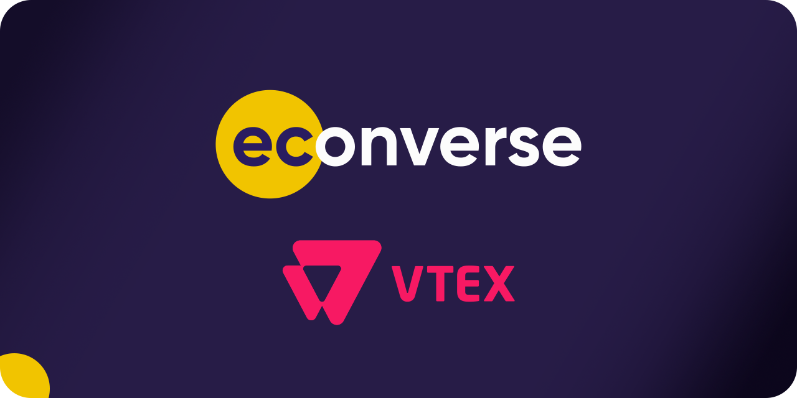
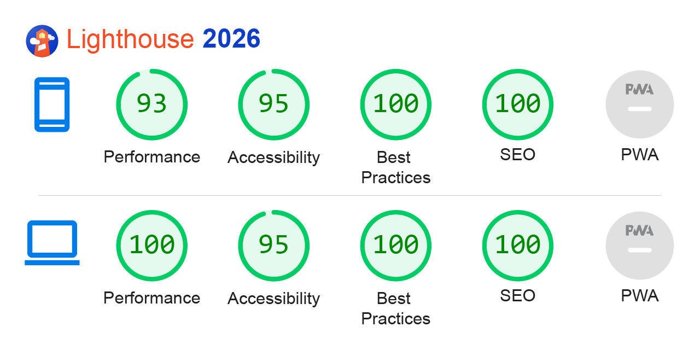

<h1 align="center"> 🔴 🟥 Econverse - VTEX 🔴 🟥 </h1>


## 📑 Table of Contents

- [📑 Table of Contents](#-table-of-contents)
- [📖 Overview](#-overview)
- [🛠️ Technologies](#-technologies)
- [⚡ Performance & PWA](#-performance--pwa)
- [🚀 Demo](#-demo)
- [📦 Install and Use](#-install-and-use)
- [📂 File Structure](#-file-structure)
- [🎨 Reference & Inspiration](#-reference--inspiration)
- [👨‍💻 Author and Contact](#%E2%80%8D-author-and-contact)

## 📖 Overview

**Econverse** is a robust frontend web application engineered to deliver a seamless shopping experience for a modern department store. Designed with a strict emphasis on Core Web Vitals and high Lighthouse scores, the platform ensures rapid product discovery and fluid navigation. Built using a modern React and TypeScript stack, the architecture prioritizes scalable global state management, clean component decoupling, and an optimized rendering pipeline to support a diverse, multi-category product catalog.

## 🛠 Technologies

The following technologies were used to build this project:

- [React](https://react.dev/)
- [Typescript](https://www.typescriptlang.org/)
- [Node.js](https://nodejs.org/en)
- [Sass](https://sass-lang.com/)
- [CSS Modules](https://github.com/css-modules/css-modules)
- [Vite](https://vite.dev/)

## ⚡ Performance & PWA



## 🚀 Demo

Access the live application below to interact with the interface and run your own performance tests

Econverse: [https://teste-front-end-jr-eight.vercel.app/](https://teste-front-end-jr-eight.vercel.app/)

### Desktop

https://github.com/Epiled/teste-front-end-jr/assets/55258483/349b8289-b663-43ef-a839-121c7cfefa76

### Mobile

https://github.com/Epiled/teste-front-end-jr/assets/55258483/6b25026c-6d91-485e-8a88-06444b04251d

## 📦 Install and Use

**Prerequisites:** Node.js (v22.x) or higher installed.

1. Clone the repository:
```bash
git clone https://github.com/Epiled/econverse.git
cd econverse
```

2. Install the dependencies:
```bash
npm install
```

3. Run the development environment (Build + Watch + Server):
```bash
npm run dev
```

4. (Optional) Generate minified build for production:
```bash
npm run build
```

## 📂 File Structure

Below is the project architecture. All development is done inside the `src/` folder. The `dist/` folder is automatically generated by Vite and should not be edited manually.

```text
econverse/
├── src/                # Main source code
│   ├── api/            # Base HTTP client configuration and request interceptors
│   ├── assets/         # Images and SVGs processed by the build pipeline
│   ├── components/     # Reusable UI components (Atomic Design principles)
│   ├── contexts/       # Global state management providers (e.g., Modals, Filters)
│   ├── hooks/          # Custom React hooks encapsulating state and fetching logic
│   ├── interfaces/     # Global TypeScript definitions and data shape contracts
│   ├── pages/          # Top-level view components representing application routes
│   ├── service/        # Abstraction layer for API endpoints and business logic
│   ├── styles/         # Global styles and theme definitions
│   ├── utils/          # Pure helper functions, constants, and data formatters
│   ├── App.tsx         # Root component
│   └── main.tsx        # Application entry point
├── public/             # Static assets (favicons, robots.txt)
├── vite.config.ts      # Custom Vite configuration (plugins and aliases)
├── tsconfig.json       # TypeScript strict configuration
└── package.json        # Project dependencies and automation scripts
```

## 🎨 Reference & Inspiration

The project's design and wireframes are available for viewing on Figma.

Figma / Wireframe: [Econverse](https://www.figma.com/file/bPKnwKLoP0TXZIWW0lKC3j/Teste-Front-End-Jr-(Copy)?type=design&node-id=0%3A1&mode=design&t=CHrQ8oxakRwqSGo0-1)

## 👨‍💻 Author and Contact

<a href="https://github.com/Epiled">
  
  <br />
  <sub><b>Felipe De Andrade</b></sub>
</a>

Made with ❤️ by Felipe De Andrade 👋🏽 Get in touch!

[](https://www.linkedin.com/in/fademendonca/)
[](https://codepen.io/epiled)
[](mailto:felipe.deam98@gmail.com)
